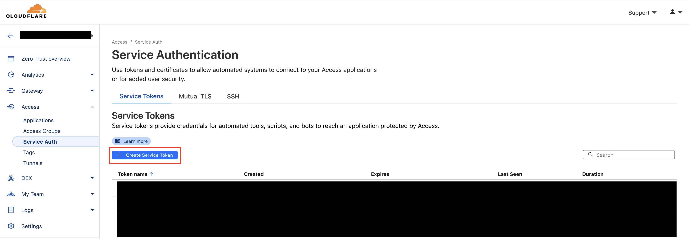

# Access Cloudflare Zero Trust Private Network from GitHub Actions

## Introduction

Using Cloudflare Zero Trust you can connect private networks and the services running on those networks to Cloudflare. These services are connected via the [Cloudflare Tunnel](https://www.cloudflare.com/products/tunnel/) software that runs on your server and establishes connections to the Cloudflare Network. One issue I encountered after setting up these private networks was automating tasks like deployments, database backups, and other tasks that need periodic access to the servers. Rather than opening up ports or exposing my internal network to the outside world I found a very useful GitHub action that allows you to install the [WARP client](https://developers.cloudflare.com/warp-client/) on the GitHub action runner which then enables ssh access to the internal network.

## Setup Cloudflare Warp GitHub Action

The [setup-cloudflare-warp](https://github.com/Boostport/setup-cloudflare-warp) action performs all the work of identifying which platform your GitHub runner is executing on, downloading the correct version of the WARP client, and installing it on the machine. The only information you need to provide is the Cloudflare `organization`, `auth_client_id`, and `auth_client_secret` and can be called from a GitHub action similar to below. Make sure that you include each variable as a GitHub action secret to ensure the values don't leak in the runner logs:

```yaml
uses: Boostport/setup-cloudflare-warp@v1
with:
  organization: ${{ secrets.CLOUDFLARE_ORGANIZATION }}
  auth_client_id: ${{ secrets.CLOUDFLARE_AUTH_CLIENT_ID }}
  auth_client_secret: ${{ secrets.CLOUDFLARE_AUTH_CLIENT_SECRET }}
```

## Finding your Cloudflare Organization

To retrieve the cloudflare organization you just need to login to your Zero Trust Dashboard and navigate to the "Custom Pages" section in your settings:


And then note the subdomain portion of your "Team Domain" which is your Cloudflare organization. In the below screenshot you can see my Cloudflare organization is `quackware`:


## Generating and Configuring Client ID and Secret

To generate the `auth_client_id` and `auth_client_secret` you need to navigate to `Access -> Service Auth` and click "Create Service Token" and follow the steps to create a new token:



Where the `Cf-Access-Client-Id` corresponds to the `auth_client_id` in the GitHub action and the `Cf-Access-Client-Secret` corresponds to the `auth_client_secret` in the GitHub action. Save these in a secure location for later use.

After saving the secrets, navigate back to the settings page and then to the "WARP Client" page:


Click the `Manage` button for "Device Enrollment Permissions" at the top of the page and then the `+ Add a rule` button to configure a new policy for your WARP devices. What we want to accomplish is to configure the client id and secret used by the GitHub action as a new "Device" that can login to our internal network:


## Private Network Address

The last bit of information we need from Cloudflare is the `Private Network Address` for the server we want to connect to. Just navigate to `Access -> Tunnels`, select the tunnel you want to connect to, then navigate to the `Private Network` tab and note the ip address:


For more information on private networks, including how to set them up, please check out the [Cloudflare private network documentation](https://developers.cloudflare.com/cloudflare-one/connections/connect-networks/private-net/).

## Testing the GitHub Action

With Cloudflare configured and the variables added to your GitHub action repository secrets we can then run a test action using the [SSH Action](https://github.com/appleboy/ssh-action) GitHub action to verify we can now access our internal network protected by Cloudflare. Below is a simple GitHub action workflow that runs `whoami` on the target server. Please note that you also need to add your server's ssh key to the GitHub action secrets in order to connect to the server and you may also need to change the `username` or `port` field depending on your server setup:

```yaml
name: Warp Test

on:
  workflow_dispatch:

jobs:
  warp-test:
    runs-on: ubuntu-latest
    timeout-minutes: 10
    steps:
      - uses: Boostport/setup-cloudflare-warp@32bb5aa348bca02c3cd1edbe25be1ddb7301cdd7 #v1.4.0
        with:
          organization: ${{ secrets.CLOUDFLARE_ORGANIZATION }}
          auth_client_secret: ${{ secrets.CLOUDFLARE_ACCESS_CLIENT_SECRET }}
          auth_client_id: ${{ secrets.CLOUDFLARE_ACCESS_CLIENT_ID }}
      - name: executing remote ssh commands using ssh key
        uses: appleboy/ssh-action@v1.0.0
        with:
          host: 10.0.0.2
          username: ubuntu
          key: ${{ secrets.SERVER_SSH_KEY }}
          port: 22
          script: whoami
```

If everything is setup correctly you should get a result like below in your GitHub action logs:


Congrats! You can now connect to and run commands on a server in your internal network thats protected by Cloudflare WARP.

## Conclusion

If you have any questions, corrections, or comments on this post please reach out to `docs@curtislarson.dev` and i'll get back to you as soon as possible. I'm also available for hire as a full stack developer or devops expert and have extensive experience working with Cloudflare infrastructure. Please reach out to `hi@quack.software` for all contract inquiries.
